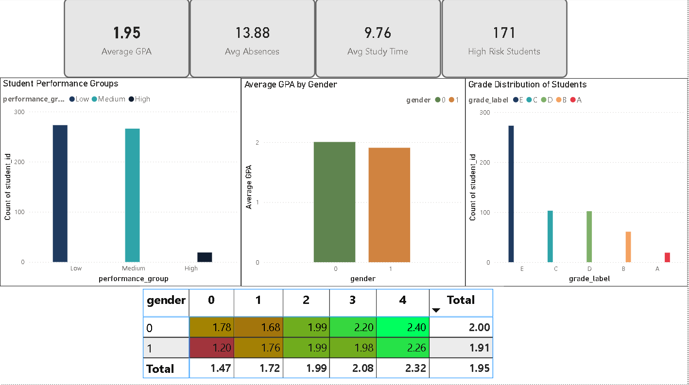
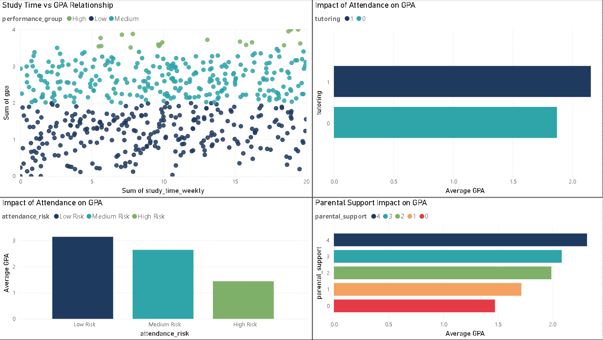
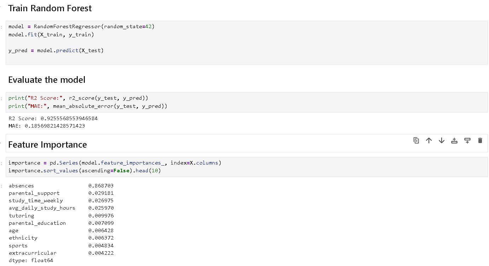

# EdTech Learning Analytics Dashboard
### Predictive Modeling & Student Performance Analysis

This project transforms student performance data into actionable educational intelligence. By implementing a high-precision **Random Forest Regressor ($R^2 \approx 0.9255$)**, the analysis identifies critical drivers of academic success—specifically student attendance and parental support—and visualizes these trends through an interactive 3-page Power BI dashboard.

## 📊 Key Project Metrics
* **Model Accuracy**: $R^2$ Score of **0.9255** with a Mean Absolute Error (MAE) of **0.1856**.
* **Cohort Overview**: Analysis of 2,392 students with an average GPA of **1.95**.
* **Attendance Impact**: Average absences for the cohort stand at **13.88**, significantly impacting grades.

## 🎯 Project Objectives
* **Predict Learning Outcomes**: Estimate student GPAs based on behavioral and demographic features.
* **Identify Performance Drivers**: Determine which factors (e.g., absences, parental support, study time) most impact success.
* **Early Risk Detection**: Classify students into risk levels (Low, Medium, High) to facilitate proactive intervention.

## 🛠️ Methodology & Tech Stack
* **Machine Learning**: Developed a **Random Forest Regressor** using Python's `scikit-learn`.
* **Feature Engineering**: Ranked variables by importance, identifying **Absences** (0.868) as the primary predictor.
* **Data Visualization**: Designed a **Power BI** dashboard tracking GPA distribution, attendance risk, and engagement impact.

## 🔍 Visual Insights

### 1. Executive Performance Overview
Tracks high-level KPIs including average GPA (1.95) and the count of high-risk students (171 identified).

### 2. Student Engagement & Support Analysis
Explores the relationship between weekly study time and GPA, alongside the positive impact of tutoring and parental support on student outcomes.

### 3. Predictive Risk & Attendance Distribution
Visualizes the distribution of 171 high-risk students who maintain a critical average GPA of only **0.88**.

### 4. Model Evaluation & Feature Importance
The Random Forest model highlights that **Absences** (86.8%) and **Parental Support** are the most significant variables in predicting student success.

## 💡 Strategic Recommendations
* **Attendance Priority**: Since **absences** have a feature importance of 0.868, school interventions must focus primarily on reducing absenteeism.
* **Targeted Support**: Educators should prioritize the 171 "High Risk" students identified by the model for immediate academic counseling.
* **Parental Engagement**: Increasing parental support shows a direct linear improvement in Average GPA, making it a key area for community focus.

---
**Tools**: Python • SQL • Power BI • Scikit-Learn  
**Analysis by**: Arjun MM
